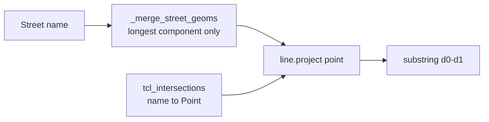
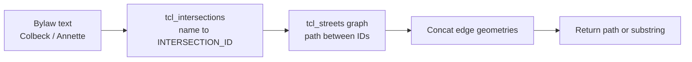

# TCL Graph-Based Geometry Redesign (Phase 1)

## Problem

Current flow in `[src/geometry_engine.py](src/geometry_engine.py)`:




This drops disconnected TCL chunks (Armadale: 16 chunks → 860 m line) and projects distant intersections onto the wrong line endpoint, causing `zero-length segment` for **992 `block` rows** alone.

TCL already stores the correct structure: **nodes** (`INTERSECTION_ID` + `INTERSECTION_DESC`) and **edges** (`FROM_INTERSECTION_ID`, `TO_INTERSECTION_ID`, geometry). Colbeck → Annette on Armadale is **3 edges, ~614 m** via graph walk — no merge required.

## Target architecture (Phase 1)




**Roles:**

- `tcl_intersections` → **name resolution only** (text → one or more `INTERSECTION_ID`s)
- `tcl_streets` → **geometry** (walk edges, concatenate segment lines)

## Scope (confirmed)

**In Phase 1** — block-family rules:

- `block`
- `parenthetical_block`
- `parenthetical_end_block`
- `block_to_terminus`
- `parenthetical_to_terminus`

**Deferred Phase 2** — offset/anchor rules still using merged line until local-path extension is designed:

- `perfect_offset`, `relative_extension`, `intersect_to_offset`, `offset_to_intersect`, `dual_anchor`, `intersect_extension`
- `entire_length`, `terminus_to_terminus`

## Implementation

### 1. New module: `[src/tcl_graph.py](src/tcl_graph.py)`

Build at startup from the streets GeoDataFrame (keep `_st_gdf` in memory during init; do not `del` until graph is built).

**Data structures per street name** (lowercased `LINEAR_NAME_FULL_LEGAL`):

```python
@dataclass
class StreetEdge:
    centreline_id: int
    from_id: int
    to_id: int
    line_gps: LineString   # single part, EPSG:4326
    line_m: LineString     # EPSG:32617

@dataclass
class StreetGraph:
    name: str
    edges: list[StreetEdge]
    adj: dict[int, list[tuple[int, StreetEdge]]]  # node -> [(neighbor, edge)]
```

**Core functions:**


| Function                                                                     | Purpose                                                                                               |
| ---------------------------------------------------------------------------- | ----------------------------------------------------------------------------------------------------- |
| `build_street_graphs(st_gdf) -> dict[str, StreetGraph]`                      | Group rows by legal name; one edge per street feature                                                 |
| `resolve_intersection_ids(highway, cross) -> list[int]`                      | Reuse `_intersection_mask` logic; return all matching `INTERSECTION_ID`s                              |
| `shortest_path(graph, id_a, id_b) -> list[StreetEdge] | None`                | BFS on `adj`; cache `(name, id_a, id_b)`                                                              |
| `pick_intersection_pair(highway, cross_a, cross_b) -> tuple[int,int] | None` | Try all candidate ID pairs; choose pair with shortest valid path (fewest edges, then shortest length) |
| `path_to_linestring(edges, orient_from, orient_to) -> LineString`            | Concat edges in walk order; flip individual edges so they connect head-to-tail                        |
| `slice_path_between(path, id_start, id_end) -> LineString`                   | Trim first/last edge at intersection nodes if needed (endpoint = node location)                       |


**Disambiguation** (fixes Colbeck’s duplicate IDs `13466420` / `13466437`):

- Do not use `match.iloc[0]`
- For block rules with start + end cross streets: enumerate candidate ID pairs, pick the pair with a valid path; prefer shortest total path length

**Qualifiers** (`parenthetical_block`, `parenthetical_end_block`, `parenthetical_to_terminus`):

- When multiple IDs match a cross street, filter/rank by qualifier using existing `_disambiguate_project_dist` logic applied to **projected position on the candidate path** (not merged line)

### 2. Refactor `[src/geometry_engine.py](src/geometry_engine.py)`

**Startup changes:**

- Load streets + intersections as today
- Build `street_graphs: dict[str, StreetGraph]` via `tcl_graph.build_street_graphs`
- Keep `street_index` / merge-longest **only for Phase 2 rule types** (offset, entire_length, terminus_to_terminus)

**New helpers:**

- `find_intersection_ids(highway, cross) -> list[int]` (wraps graph resolver)
- `slice_block_path(highway, id_start, id_end) -> SliceResult` — graph walk + concat + return GPS geometry directly (skip `d0`/`d1` on merged line)

**Rule handler changes (Phase 1):**


| Rule                        | New behavior                                                                                                                             |
| --------------------------- | ---------------------------------------------------------------------------------------------------------------------------------------- |
| `block`                     | `pick_intersection_pair` → `shortest_path` → return path geometry                                                                        |
| `parenthetical_block`       | Resolve start ID(s) with qualifier → end ID(s) → path                                                                                    |
| `parenthetical_end_block`   | Start ID → end ID with qualifier → path                                                                                                  |
| `block_to_terminus`         | Path from start intersection to **terminus end of the path’s connected component** containing that intersection (not global merged line) |
| `parenthetical_to_terminus` | Same, with qualified start ID                                                                                                            |


**New failure codes** (add to ledger docs):


| Code                     | When                                                            |
| ------------------------ | --------------------------------------------------------------- |
| `DISCONNECTED_BLOCK`     | No graph path between resolved intersection IDs on this highway |
| `AMBIGUOUS_INTERSECTION` | Multiple ID pairs tie or qualifier cannot disambiguate          |


Keep `GEOMETRY_ERROR` / `zero-length segment` as fallback if trimmed path is still degenerate.

`**block_to_terminus` terminus logic:**

- Find the connected component containing the start intersection ID within the street graph
- Compute terminus as min/max compass extremity **on that component’s concatenated geometry** (reuse `_terminus_dist_on_line` on the component line, not merge-longest)

### 3. Validation

**Regression exemplars** (manual + automated):


| row_id | Highway              | Between           | Expected                                                          |
| ------ | -------------------- | ----------------- | ----------------------------------------------------------------- |
| 282    | Armadale Avenue      | Colbeck / Annette | ~614 m path, 3 edges (7963621, 14014944, 14014945)                |
| 198    | Adelaide Street West | Massey / Strachan | Should produce non-zero span (currently collapsed on merged line) |


**New tests:** `[tests/test_tcl_graph.py](tests/test_tcl_graph.py)`

- Armadale Colbeck → Annette path exists, length within tolerance of 614 m
- `pick_intersection_pair` chooses northern Colbeck ID (path toward Annette), not southern dead-end
- Disconnected pair returns `None`

**Pipeline re-run metrics** (compare before/after):

```bash
.venv/bin/python src/geometry_engine.py
.venv/bin/python scripts/analyze_geometry_failures.py
```

Target Phase 1 improvements:

- `block_projection_collapse`: 992 → near 0
- `block_same_intersection_point`: investigate remaining (may need ID disambiguation tweaks)
- Overall `GEOMETRY_ERROR`: 2032 → ~800–1000 (offset clamp failures unchanged in Phase 1)
- Geo successes should increase by ~900+

Update `[scripts/analyze_geometry_failures.py](scripts/analyze_geometry_failures.py)` to use graph path diagnostics for block-family rows (optional: add `path_edge_count`, `path_length_m` columns).

### 4. Documentation

Update `[docs/README.md](docs/README.md)` Geometry section:

- Describe nodes (intersections) + edges (street segments) model
- Note merge-longest is legacy for offset rules only (Phase 1)
- Document new failure codes
- Link to Phase 2 plan for offset rules

## File change summary


| File                                                                           | Change                                                                                    |
| ------------------------------------------------------------------------------ | ----------------------------------------------------------------------------------------- |
| `[src/tcl_graph.py](src/tcl_graph.py)`                                         | **New** — graph build, path find, disambiguation, concat                                  |
| `[src/geometry_engine.py](src/geometry_engine.py)`                             | Init graph; route block-family rules through `tcl_graph`; keep merge path for other rules |
| `[tests/test_tcl_graph.py](tests/test_tcl_graph.py)`                           | **New** — Armadale + edge cases                                                           |
| `[docs/README.md](docs/README.md)`                                             | Architecture + failure codes                                                              |
| `[scripts/analyze_geometry_failures.py](scripts/analyze_geometry_failures.py)` | Optional graph-aware diagnostics                                                          |


## Phase 2 preview (out of scope, not implemented now)

Offset rules need **local path from anchor intersection** extending in compass direction along the graph (not a global merged line), plus handling when offset exceeds component length (`clamp_at_endpoint` bucket, ~587 rows). Design after Phase 1 metrics confirm block-family recovery.

## Risks and mitigations


| Risk                                | Mitigation                                                                            |
| ----------------------------------- | ------------------------------------------------------------------------------------- |
| Multiple valid paths (grid streets) | Shortest-path tie-break; log when multiple equal paths                                |
| Performance (BFS per row)           | Cache `(highway, id_a, id_b)` paths; street graphs are small (~16 edges for Armadale) |
| Thread safety with `@lru_cache`     | Graph is read-only after init; clear caches if needed or use per-graph dict cache     |
| Breaking offset rules               | Phase 1 leaves them on existing merge-longest path unchanged                          |


## Success criteria

1. Row 282 (Armadale Colbeck–Annette) produces a ~614 m LineString through 3 TCL edges
2. `block_projection_collapse` count drops from 992 to near zero
3. No regression in geo successes for non-block rule types
4. New tests pass; full geo pipeline completes

