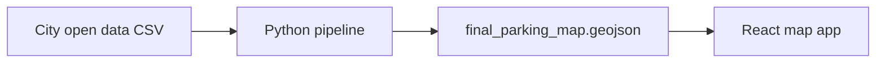

# Toronto Parking Map

[](https://github.com/JoeHershkie/toronto-parking-map/actions/workflows/pipeline-ci.yml)
[](https://github.com/JoeHershkie/toronto-parking-map/actions/workflows/web-ci.yml)

Turn Toronto parking bylaw open data into an interactive map of curb restrictions — no parking, no stopping, no standing, and time-limited zones.

## Why this is hard

City open data lists *what* is restricted on each curb segment, but the geographic description is legal text — not coordinates:

> *"A point 59 metres north of Elm Avenue and Spadina Road"*

This project parses that text, resolves street names against the [Toronto Centreline (TCL)](https://open.toronto.ca/dataset/toronto-centreline-tcl/), walks centreline graphs to find the legal span, places that span on a curb using Toronto Road Edge polygons (with a calibrated offset fallback), and exports map-ready GeoJSON for a React + MapLibre frontend.

**Scale (full local runs, 2026-06-18):** 76,849 raw bylaw rows → 21,433 map features. Failure-ledger triage drove `INTERSECTION_NOT_FOUND` from ~6,600 (early runs) → 1,174 on the current codebase.

> **Throughput vs accuracy:** These figures count how many rows were parsed, resolved, and emitted as map features — not whether each segment is placed on the correct stretch of curb. Features carry a `curb_geometry_method` (`road_edge`, `offset_fallback`, or `centerline_unresolved`); those are not equivalent quality. See [`pipeline/tests/test_geometry_golden.py`](pipeline/tests/test_geometry_golden.py) for regression coverage on the sample cohort.
>
> **Reproducibility:** Full-run numbers depend on locally maintained, gitignored alias tables (`highway_aliases.csv`, `street_aliases.csv`) and the vintage of your Toronto open-data downloads. They are not third-party reproducible without those inputs.

## Repository layout

| Path | Description |
|------|-------------|
| [`pipeline/`](pipeline/) | Python ETL: parse bylaws, resolve streets, emit GeoJSON |
| [`web/`](web/) | React + TypeScript map UI |
| [`pipeline/docs/README.md`](pipeline/docs/README.md) | Pipeline deep-dive (schemas, curb geometry, failure codes) |



## Quick start

### Prerequisites

- Python 3.12+ (3.14 tested locally; CI runs 3.12–3.14)
- Node.js 22+ (for the web app)
- Toronto Centreline / intersection files (see [Data acquisition](#data-acquisition)); the bylaw dump is fetched automatically

### Pipeline

```bash
./scripts/setup.sh          # once per clone / after pull (creates .venv, pip install -e)
source .venv/bin/activate   # Windows: .venv\Scripts\activate

# Run stages (or use: parking-run)
parking-clean               # fetches/refreshes toronto_raw_parking_dump.csv from Open Data
parking-parse-schedule
parking-parse-between
parking-resolve             # auto-refreshes tcl_street_names.csv when stale
parking-geo                 # or: parking-geo --require-road-edges
```

Use `-v` / `--verbose` on any stage for debug logging, or set `PARKING_VERBOSE=1`.

### Web app

```bash
cd web
cp .env.example .env    # optional: Google Places API key for address search
npm ci
npm run dev             # runs sync-data first when pipeline output exists
```

`npm run sync-data` copies `pipeline/data/final_parking_map.geojson` into `web/public/data/` when present (also runs automatically before `dev` and `build`). Pipeline output may include `MultiLineString` features (both curbs, disjoint spans, coverage gaps); the current map client still assumes `LineString` and may ignore those until a later update. The pipeline does not flatten features to match the client.

### Tests

```bash
cd pipeline
pytest                    # uses data/samples/ when full TCL / Road Edge files are absent
ruff check src tests scripts
```

```bash
cd web
npm test
npm run build
```

CI runs on push to `main` (see badges above).

## Data acquisition

`parking-clean` / `parking-run` fetch [Traffic and Parking By-law Schedules](https://open.toronto.ca/dataset/traffic-and-parking-by-law-schedules/) from Toronto's CKAN API and write `pipeline/data/toronto_raw_parking_dump.csv` when the catalogue copy is newer than the local file (or the file is missing). Geocoding still uses **local** TCL / Road Edge files — those are not downloaded at runtime.

| File | Source |
|------|--------|
| `toronto_raw_parking_dump.csv` | Auto-fetched from [Traffic and Parking By-law Schedules](https://open.toronto.ca/dataset/traffic-and-parking-by-law-schedules/) (datastore CSV dump). `--skip-refresh` / `PARKING_SKIP_OPENDATA=1` to reuse a local copy; `--force-refresh` / `PARKING_FORCE_OPENDATA=1` to re-download. |
| `tcl_streets.geojson` | [Toronto Centreline (TCL)](https://open.toronto.ca/dataset/toronto-centreline-tcl/) |
| `tcl_intersections.geojson` | [Intersection file](https://open.toronto.ca/dataset/intersection-file-city-of-toronto/) |
| `topographic_road_edges.gpkg` | `python scripts/fetch_topographic_road_edges.py` (from `pipeline/`). Writes the GeoPackage plus `topographic_road_edges.manifest.json`. |

`parking-resolve` regenerates `tcl_street_names.csv` when it is missing or older than `tcl_streets.geojson`. To force a refresh: `python scripts/export_tcl_street_names.py --force` (from `pipeline/` with the venv active).

After the Road Edge download, keep `pipeline/data/topographic_road_edges.gpkg` (gitignored). `parking-geo` only reads it. Use `parking-geo --require-road-edges` so a missing full snapshot fails instead of copying the CI sample fixture. Unmatched *rows* still use calibrated-offset / centreline fallback; a missing *file* does not.

Committed [`pipeline/data/samples/`](pipeline/data/samples/) fixtures (TCL plus a small Road Edge GeoPackage covering straight, curved, intersection, and divided-road cases) let tests and CI run without the full downloads. Pytest copies missing samples into `pipeline/data/` when the full files are absent.

Regenerate TCL sample fixtures after changing fixture streets:

```bash
cd pipeline
python scripts/build_sample_fixtures.py
```

Rewrite the Road Edge sample fixture (no network):

```bash
cd pipeline
python scripts/fetch_topographic_road_edges.py --write-sample
```

## License

MIT — see [LICENSE](LICENSE).
