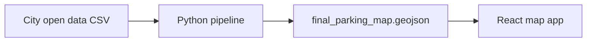

# Toronto Parking Map

Turn Toronto parking bylaw open data into an interactive map of curb restrictions — no parking, no stopping, no standing, and time-limited zones.

<!-- Uncomment after adding docs/img/map-screenshot.png from the web app:

-->

## Why this is hard

City open data lists *what* is restricted on each curb segment, but the geographic description is legal text — not coordinates:

> *"A point 59 metres north of Elm Avenue and Spadina Road"*

This project parses that text, resolves street names against the [Toronto Centreline (TCL)](https://open.toronto.ca/dataset/toronto-centreline-tcl/), walks centreline graphs to find block geometry, and exports map-ready GeoJSON for a React + MapLibre frontend.

**Scale (full local runs):** ~80k raw bylaw rows → ~19k map features. Failure-ledger triage drove `INTERSECTION_NOT_FOUND` from 6,601 → ~2,819 over iterative fixes.

## Repository layout

| Path | Description |
|------|-------------|
| [`pipeline/`](pipeline/) | Python ETL: parse bylaws, resolve streets, emit GeoJSON |
| [`web/`](web/) | React + TypeScript map UI |
| [`pipeline/docs/README.md`](pipeline/docs/README.md) | Pipeline deep-dive (schemas, failure codes, geometry model) |



## Quick start

### Prerequisites

- Python 3.12+
- Node.js 22+ (for the web app)
- Toronto open-data files (see [Data acquisition](#data-acquisition))

### Pipeline

```bash
cd pipeline
python -m venv .venv
source .venv/bin/activate   # Windows: .venv\Scripts\activate
pip install -e ".[dev]"

# Run stages (or use: parking-run)
parking-clean
parking-parse-schedule
parking-parse-between
parking-resolve
parking-geo
```

Use `-v` / `--verbose` on any stage for debug logging, or set `PARKING_VERBOSE=1`.

### Web app

```bash
cd web
cp .env.example .env    # add your MapTiler or other tile key
npm ci
npm run dev
```

Copy `pipeline/data/final_parking_map.geojson` to `web/public/data/` (or configure your loader path).

### Tests

```bash
cd pipeline
pytest                    # uses data/samples/ when full TCL is absent
ruff check src tests scripts
```

```bash
cd web
npm test
npm run build
```

CI runs on push to `main` (see badges once published to GitHub).

## Data acquisition

Download these datasets manually from Toronto Open Data and place them under `pipeline/data/`:

| File | Source |
|------|--------|
| `toronto_raw_parking_dump.csv` | [Traffic and Parking By-law Schedules](https://open.toronto.ca/dataset/traffic-and-parking-by-law-schedules/) |
| `tcl_streets.geojson` | [Toronto Centreline (TCL)](https://open.toronto.ca/dataset/toronto-centreline-tcl/) |
| `tcl_intersections.geojson` | [Intersection file](https://open.toronto.ca/dataset/intersection-file-city-of-toronto/) |

Then generate the highway index:

```bash
cd pipeline
python scripts/export_tcl_street_names.py
```

Committed [`pipeline/data/samples/`](pipeline/data/samples/) fixtures let tests and CI run without the full ~120MB TCL download. Regenerate samples after changing fixture streets:

```bash
python scripts/build_sample_fixtures.py
```

## License

MIT — see [LICENSE](LICENSE).
