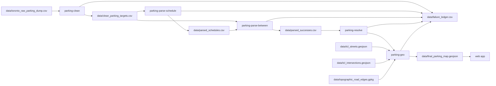

# Toronto parking bylaws — pipeline deep-dive

Python ETL for Toronto parking bylaws. See the root [README.md](../README.md) for quick start, installation, and CLI usage. Frontends live in [parkking-ios](https://github.com/JoeHershkie/parkking-ios) and [parkking-web](https://github.com/JoeHershkie/parkking-web).

## Repository layout

```
parking-pipeline/          # repo root
├── data/                  # Source dumps, generated CSVs, TCL / Road Edge, map output
├── docs/                  # Architecture, schema, and local dev documentation
├── scripts/               # Analysis, triage, fixture builders, one-time downloaders
├── src/parking_pipeline/  # Core ETL library and CLI entry points
├── tests/                 # Unit tests, integration tests, golden regression suites
└── pyproject.toml         # Package dependencies and configuration
```

## Pipeline overview



Geocoding uses **local files** on disk (TCL streets/intersections and topographic Road Edge polygons). `parking-run` never talks to a live geocoding API or the Road Edge FeatureServer. It does refresh the bylaw dump from Toronto Open Data CKAN during `parking-clean` unless `--skip-refresh` / `PARKING_SKIP_OPENDATA=1` is set.

## Quick start

From the repo root (first time or after pull):

```bash
./scripts/setup.sh
source .venv/bin/activate
```

Running stages:

```bash
# End-to-end:
parking-run

# Or sequentially:
parking-clean      # fetches/refreshes toronto_raw_parking_dump.csv from Open Data
parking-parse-schedule
parking-parse-between
parking-resolve    # auto-refreshes tcl_street_names.csv when stale
parking-geo
# Full-city maps: parking-geo --require-road-edges  (after downloading Road Edge once)
```

Use `-v` / `--verbose` on any stage for debug logging, or set `PARKING_VERBOSE=1`.

`parking-geo --require-road-edges` fails fast (exit 2) if `data/topographic_road_edges.gpkg` is missing, instead of copying the committed sample fixture. `parking-run` does not take that flag; it calls `parking-geo` with defaults. Hybrid fallback still applies to unmatched *rows* when the local source is present.

**Geometry env vars:** `GEO_LIMIT` — cap rows processed (omit for full `parsed_successes.csv`). `GEO_WORKERS` — thread pool size (`0` = sequential). Threading helps I/O-bound steps; CPU-heavy Shapely work may see limited speedup under the GIL.

Paths resolve via [`src/parking_pipeline/paths.py`](../src/parking_pipeline/paths.py) (`data/` is relative to repo root).

## Console scripts

| Command | Module | Stage |
|---------|--------|-------|
| `parking-clean` | `clean_data` | Refresh raw dump from CKAN, then filter & unpack |
| `parking-parse-schedule` | `parse_schedule` | Parse time-of-day strings |
| `parking-parse-between` | `parse_between` | Parse `Between` segment text |
| `parking-resolve` | `resolve_rows` | Map `Highway` → TCL keys |
| `parking-geo` | `geometry_engine` | Slice centreline spans and emit curb geometry |
| `parking-run` | `fullrun` | All stages + failure analysis |

## Metrics snapshot (2026-06-18)

Full local run against Toronto open-data exports (see [Data sources](#data-sources)). `parking-resolve` keeps `tcl_street_names.csv` in sync with `tcl_streets.geojson` automatically.

| Metric | Value |
|--------|------:|
| Raw bylaw rows | 76,849 |
| Clean curb-rule targets | 23,152 |
| Parsed (`Between`) rows | 22,941 |
| Highway resolved to TCL | 22,763 (99.2%) |
| **Map features (GeoJSON)** | **21,433** |
| `INTERSECTION_NOT_FOUND` (geo) | 1,174 |
| `RESOLVE_STREET_NOT_FOUND` | 178 |
| `PARSE_NO_MATCH` | 188 |
| `ZERO_SPAN` | 67 |
| `GEOMETRY_ERROR` (collapse) | 0 |
| `GEOMETRY_EXCEPTION` | 0 |
| `EMPTY_GEOMETRY` | 0 |

**Historical context:** Early pipeline runs reported ~6,600 `INTERSECTION_NOT_FOUND` failures and ~12k map features before intersection normalizer work, new regex rule types, and alias tables. The snapshot above reflects the current codebase on the same city datasets.

> **Throughput vs accuracy:** These metrics count parsed, resolved, and mapped rows — not whether each emitted segment is on the correct curb. Inspect `curb_geometry_method` / `curb_confidence` on each feature (see [Quality tiers](#quality-tiers)). Full-run totals also depend on gitignored alias tables (`highway_aliases.csv`, `street_aliases.csv`) and your open-data download vintage; they are not third-party reproducible without those inputs. Sample-cohort geometry regression lives in [`tests/test_geometry_golden.py`](../tests/test_geometry_golden.py).

## Data files

| File | Source / generated | Role |
|------|-------------------|------|
| `data/toronto_raw_parking_dump.csv` | **Source** (auto-fetched) | CKAN datastore dump of [Traffic and Parking By-law Schedules](https://open.toronto.ca/dataset/traffic-and-parking-by-law-schedules/). Sidecar: `toronto_raw_parking_dump.manifest.json`. |
| `data/clean_parking_targets.csv` | Generated | Active curb-parking schedules after filter & unpack |
| `data/parsed_schedules.csv` | Generated | Structured time-of-day JSON per `_id` |
| `data/parsed_successes.csv` | Generated | Rows where `Between` parsed successfully |
| `data/tcl_streets.geojson` | **Source** | Toronto Centreline street segments |
| `data/tcl_intersections.geojson` | **Source** | Intersection points |
| `data/topographic_road_edges.gpkg` | **Source** | Road Edge + Intersection polygons (gitignored; download once) |
| `data/topographic_road_edges.manifest.json` | **Source sidecar** | Provenance for the GeoPackage (gitignored with it) |
| `data/tcl_street_names.csv` | Generated | Unique TCL legal names for highway resolve |
| `data/curb_geometry_overrides.csv` | **Curated** | Rare per-row curb overrides keyed by `_id` |
| `data/final_parking_map.geojson` | Generated | Map-ready line features (curb geometry + provenance) |
| `data/curb_geometry_qa.csv` | Generated | Per-feature curb method / confidence / warnings |
| `data/curb_geometry_qa_summary.json` | Generated | Compact rollups (methods, warnings, offset stats) |
| `data/failure_ledger.csv` | Generated | Row-level failures from all stages |

Committed [`data/samples/`](../data/samples/) fixtures let tests and CI run without the full TCL download (~120 MB) or the full Road Edge GeoPackage. Pytest copies missing files via [`tests/sample_data.py`](../tests/sample_data.py) (`ensure_sample_data_copies()`). `parking-geo` also copies the Road Edge sample into `data/` when the full GeoPackage is absent, unless `--require-road-edges` is set.

## Schedule JSON contract

Produced by [`parse_schedule.py`](../src/parking_pipeline/parse_schedule.py) / [`schedule_format.py`](../src/parking_pipeline/schedule_format.py). Embedded in GeoJSON as the `schedule` property (`v: 1`).

**Membership filter:** `overlaps_membership(schedule, slot)` — same contract implemented in Python and in the web client ([parkking-web](https://github.com/JoeHershkie/parkking-web)). Cross-language parity is enforced by [`tests/fixtures/schedule_corpus.json`](../tests/fixtures/schedule_corpus.json) (regenerate via `PYTHONPATH=src python scripts/build_schedule_corpus.py`).

| Slot field | Required | Notes |
|------------|----------|--------|
| `dayOfWeek` | yes | `0=Sun` … `6=Sat` |
| `minuteOfDay` | yes | `0–1439` |
| `month` | yes | `1–12` |
| `dayOfMonth` | yes | `1–31` |
| `year` | recommended | Needed for `calendar.dayOfMonthRanges` with `end: "last"` |

`failed` schedules return `False` from `overlaps_membership` (the web app may still show them with a warning). `partial` uses OR over parsed windows only. Ontario public holidays use the `holidays` package ([`public_holidays.py`](../src/parking_pipeline/public_holidays.py)).

Range-based helpers (`overlapsMembershipInRange`, `membershipFullyCoversRange`) exist only in the web app for time-window filtering.

## Parsing (`parse_between`)

Ordered regex patterns in [`parse_between.py`](../src/parking_pipeline/parse_between.py) match `Between` text. Successful rows land in `parsed_successes.csv` with flat columns from [`parse_format.py`](../src/parking_pipeline/parse_format.py).

| `rule_type` | Example pattern |
|-------------|-----------------|
| `perfect_offset` | Intersection + point N metres direction |
| `intersect_to_offset` | Intersection + point N metres direction of another street |
| `offset_to_intersect` | Point offset from one intersection to another |
| `relative_extension` | Two chained offset points |
| `offset_span` | Two metric offsets from the same cross street |
| `dual_anchor` | A point X of street A and a point Y of street B |
| `block` | Two intersections |
| `block_to_terminus` | Cross street and the west end of … |
| `terminus_to_terminus` | Both ends of the same street |
| `parenthetical_block` | Walmer Road (west intersection) and Spadina Road |
| `entire_length` | `Entire length` |

Unmatched rows are recorded in `failure_ledger.csv` with `stage=parse`.

## Resolve (`resolve_rows`)

Maps bylaw `Highway` values to TCL centreline keys via [`tcl_highway_resolve.py`](../src/parking_pipeline/tcl_highway_resolve.py) and [`lane_highway_resolve.py`](../src/parking_pipeline/lane_highway_resolve.py). Refreshes `tcl_street_names.csv` from `tcl_streets.geojson` when missing or stale ([`street_names_csv.py`](../src/parking_pipeline/street_names_csv.py)). Curated renames go in `data/highway_aliases.csv` and `data/street_aliases.csv` (gitignored; download or maintain locally).

## Geometry (`geometry_engine`)

After parse/resolve succeed, `parking-geo` does two steps per source row:

1. **Centreline slice** — locate the legal span on TCL. Semantics live in [`geo_slice.py`](../src/parking_pipeline/geo_slice.py) / [`tcl_graph.py`](../src/parking_pipeline/tcl_graph.py) and stay independently testable.
2. **Curb resolution** — place that span on a side-specific curb using local Road Edge polygons ([`road_edges.py`](../src/parking_pipeline/road_edges.py), [`curb_geometry.py`](../src/parking_pipeline/curb_geometry.py), [`curb_side.py`](../src/parking_pipeline/curb_side.py)).

**Block-family rules** walk centreline graphs between resolved intersection IDs (`centreline_construction=block_path`, exact TCL `CENTRELINE_ID`s). **Offset / terminus rules** merge TCL chunks and slice by projected distance (`distance_merge`); IDs are recovered spatially and `merge_dropped_component` is true when merge-longest discarded a component. Disjoint block geometry uses `disjoint_block`.

Slice/resolve failures still drop the row from the map (ledger `stage=geo`):

| `reason_code` | When |
|---------------|------|
| `STREET_NOT_FOUND` | No TCL match for highway |
| `INTERSECTION_NOT_FOUND` | Cross street not found in intersection index |
| `DISCONNECTED_BLOCK` | No graph path between intersection IDs |
| `AMBIGUOUS_INTERSECTION` | Multiple ID pairs tie on shortest path |
| `ZERO_SPAN` | No mappable curb segment (expected skip) |
| `GEOMETRY_ERROR` | Degenerate projection / zero-length segment (collapse) |
| `GEOMETRY_EXCEPTION` | Unhandled slice exception |
| `EMPTY_GEOMETRY` | Slice returned empty geometry |
| `MISSING_RULE_TYPE` | Row reached geo without `rule_type` |
| `PARSE_INVALID` | Parse validation failed (may surface at geo stage) |

Curb warning codes on emitted features (below) are **not** ledger failures. Ambiguous or low-coverage curbs stay on the map with method/confidence metadata.

### Road Edge as a local source

Same class of file as `tcl_streets.geojson`: download once, keep it under `data/`, reuse it on every `parking-geo` run. The Open Data catalogue page is retired ([Topographic Mapping - Edge of Road](https://open.toronto.ca/dataset/topographic-mapping-edge-of-road/)) even though the official FeatureServer remains live. There is no shapefile URL, so acquisition is a helper script — not a runtime fetch.

From repo root (venv active):

```bash
python scripts/fetch_topographic_road_edges.py
python scripts/fetch_topographic_road_edges.py --force          # replace even if counts drop
python scripts/fetch_topographic_road_edges.py --write-sample   # rewrite CI fixture; no network
```

Writes `data/topographic_road_edges.gpkg` (layer `road_edges`, `Road Edge` + `Intersection` polygons) and `data/topographic_road_edges.manifest.json`. The live service currently reports 34,445 Road Edge features; the script validates counts against the service and any existing snapshot before replacing (floors: ≥34,000 Road Edge, ≥19,000 Intersection, ≥99% of live counts, ≥95% of the previous snapshot). `--force` skips those floors.

The full GeoPackage is gitignored (tens of MB, like TCL). The committed sample under [`data/samples/`](../data/samples/) covers straight, curved, intersection, and divided-road cases.

### Provenance

| Layer | What it records |
|-------|-----------------|
| Manifest sidecar | `service_url`, `query`, `fetch_time`, `feature_counts`, `crs`, `max_last_geometry_maint`, `catalogue_url` / `catalogue_status` (`retired`). Sample fixtures set `is_sample_fixture: true`. |
| GeoJSON `metadata.road_edges` | Local source path, projected CRS (`EPSG:32617`), copied manifest, `road_strip_count`, `intersection_count` |
| GeoJSON `metadata.curb_geometry` | Method counts, mean confidence, `conservative_global_offset_m` (3.5 m) |
| Feature properties | `centreline_ids` (TCL `CENTRELINE_ID` list), `centreline_construction`, `merge_dropped_component`, `road_edge_object_ids` |

Centreline IDs are for parity, offset calibration, and audit. They do not change the legal span geometry from `slice_street`.

### Quality tiers

`curb_geometry_method` is not a single “we found a curb” flag. The three values are **not equivalent quality**:

| `curb_geometry_method` | Meaning |
|------------------------|---------|
| `road_edge` | Measured left/right tracks from Road Edge polygon boundaries (physical curb source) |
| `offset_fallback` | Shapely `offset_curve` in EPSG:32617 using a calibrated distance (estimate) |
| `centerline_unresolved` | Legal centreline retained because curb selection failed; **not** a curb |

Fallback distance, in order: median measured offset on this centreline from successful Road Edge samples, then the empirical median for the TCL feature class, then the documented conservative global separation (3.5 m). Reversing input coordinate order must select the same physical geometry. Empty, invalid, point-like, self-crossing, or too-close-to-opposite candidates stay `centerline_unresolved` with a warning — they are not silently labelled as curbs.

### SideSpec and overrides

[`parse_side()`](../src/parking_pipeline/curb_side.py) keeps the raw `Side` string and classifies a `SideSpec` (`side_mode` on the feature):

| `side_mode` | Typical input | Geometry behaviour |
|-------------|----------------|--------------------|
| `single` | `North`, `Northeast` | One curb |
| `wrapping` | Adjacent compounds (`North and east`) | One potentially wrapping curb |
| `multi` | `Both`, `All`, opposing pairs (`North and south`) | Both curbs → often `MultiLineString` |
| `parity` | `Odd` / `Even` | TCL `PARITY_L` / `PARITY_R` when orientation is unambiguous (`block_path` only) |
| `perimeter` | Inner/outer perimeter or radius | Ring when Road Edge topology supports it |
| `specialized` | Island, median, lay-by, leg, centre, cul-de-sac, … | Needs an override or stays unresolved |
| `unresolved` | Blank or unsupported text | Same |

Normalization handles case, punctuation, `/`, `&`, repeated words, and compass synonyms; qualifiers (leg, bound, adjacent, inner/outer) are retained.

Rare topology-dependent cases go in [`data/curb_geometry_overrides.csv`](../data/curb_geometry_overrides.csv), keyed by source `_id`. Columns: `row_id`, `reason`, `method`, `notes`. Lines starting with `#` are ignored. Overrides apply **only** after `parse_side()` leaves `specialized` or `unresolved` — they do not override cardinal/`Both` rows. `method` should be `road_edge`, `offset_fallback`, or `centerline_unresolved` (`calibrated_offset` is accepted as an alias of `offset_fallback`).

### Output schema

One GeoJSON feature per source bylaw row. Geometry is **`LineString` or `MultiLineString` only** (EPSG:4326). Nested line parts are flattened; zero-length, non-finite, and invalid components are dropped. `Point`, polygon, and `GeometryCollection` output is rejected. `MultiLineString` is used for `Both` / opposing sides, disjoint blocks, and genuine coverage gaps.

The current web app types and hit-testing assume `LineString` only. Standards-compliant `MultiLineString` features may need later client interaction/type updates; the pipeline does not flatten or duplicate features to match that assumption.

Existing properties (`Highway`, `Rule`, `schedule_category`, raw `Side`, `max` / `maxMinutes`, `schedule`) are unchanged. Added:

| Property | Type | Notes |
|----------|------|--------|
| `side_mode` | string | `SideSpec.mode` |
| `centreline_ids` | int[] | TCL IDs for the sliced span |
| `centreline_construction` | string | `block_path` / `disjoint_block` / `distance_merge` |
| `merge_dropped_component` | bool | Distance-merge discarded a linemerge component |
| `curb_geometry_method` | string | Quality tier (table above) |
| `curb_confidence` | number | 0–1 |
| `curb_coverage` | number | Fraction of centreline with Road Edge hits |
| `median_offset_m` | number \| null | Metres, projected |
| `road_edge_object_ids` | int[] | Source `OBJECTID`s |
| `curb_override` | bool | Curated override applied |
| `curb_warnings` | string[] | Codes below |
| `disjoint_block` | bool | Present only when the centreline slice was already a `MultiLineString` |

Warning codes (usable rows; distinct from parse/resolve/`reason_code`):

| Code | When |
|------|------|
| `ROAD_EDGE_NO_MATCH` | No Road Edge polygon along the span |
| `ROAD_EDGE_LOW_COVERAGE` | Hits exist but coverage is below the 0.4 threshold |
| `SIDE_AMBIGUOUS` | Compass/parity/margin cannot pick a side |
| `CURB_INVALID` | Candidate failed validity / length / simplicity gates |
| `CENTERLINE_FALLBACK` | Offset fallback used, or centreline retained |

`parking-geo` also writes `data/curb_geometry_qa.csv` (one row per feature, same provenance/QA fields as above) and `data/curb_geometry_qa_summary.json` (method/warning counts, unresolved `Side` values, low-confidence and fallback counts, measured-offset percentiles, plus the Road Edge manifest).

### Known ambiguity classes

These stay specialized, wrapping, or unresolved rather than guessed:

- **Adjacent compounds** (`North and east`) — one wrapping curb, not two opposite sides. Slash `North/East` is the same class; hyphen `North-East` is the diagonal `northeast`.
- **Opposing / Both / All** — both curbs (`multi`).
- **Diagonals** (`Northeast`) — a single compass; on bent streets the local tangent can sit near a 45° boundary.
- **Islands, medians, lay-bys, legs, centre, cul-de-sac, roadway/bound, ends** — `specialized`; use an override or accept `centerline_unresolved`.
- **Inner/outer rings** — resolved only when polygon topology supports the distinction.
- **Odd/Even** — requires unambiguous centreline orientation (`block_path`) and a unique `PARITY_L` / `PARITY_R` match.

## Failure triage

```bash
parking-run
# Or individually:
PYTHONPATH=src python scripts/analyze_intersection_failures.py
PYTHONPATH=src python scripts/analyze_geometry_failures.py
PYTHONPATH=src python scripts/analyze_street_failures.py
PYTHONPATH=src python scripts/triage_failure_ledger.py
```

Writes `data/failure_triage.csv` and `data/failure_triage_summary.json` with `fix_tier` labels (`A_intentional`, `A_skipped`, `B_quick`, `C_medium`, `D_hard`).

## Tests

```bash
pytest
ruff check src tests scripts
```

Schedule parity: `tests/test_schedule_corpus.py` shares `tests/fixtures/schedule_corpus.json` with the web client. Curb-side / Road Edge / curb-geometry tests live in `tests/test_curb_side.py`, `tests/test_road_edges.py`, and `tests/test_curb_geometry.py`.

## Data sources

| Asset | URL |
|-------|-----|
| Parking bylaws dump | Auto-fetched by `parking-clean` / `parking-run` from the CKAN datastore CSV ([Traffic and Parking By-law Schedules](https://open.toronto.ca/dataset/traffic-and-parking-by-law-schedules/)). `--skip-refresh` stays offline. |
| Toronto Centreline (TCL) | [Toronto Centreline (TCL)](https://open.toronto.ca/dataset/toronto-centreline-tcl/) |
| Intersection file | [Intersection file](https://open.toronto.ca/dataset/intersection-file-city-of-toronto/) |
| Road Edge / Intersection polygons | Live [FeatureServer layer 3](https://gis.toronto.ca/arcgis/rest/services/cot_geospatial3/FeatureServer/3) via `scripts/fetch_topographic_road_edges.py`. Catalogue page ([Topographic Mapping - Edge of Road](https://open.toronto.ca/dataset/topographic-mapping-edge-of-road/)) is retired. |

## Current limitations

- Street/intersection matching is heuristic; ambiguous `INTERSECTION_DESC` matches can misplace segments.
- On diagonal centrelines, compass-directed offsets can be unstable; diagonal `Side` values have the same local-tangent issue.
- Road Edge tracks, calibrated offsets, and `centerline_unresolved` are different quality tiers — do not treat them as equivalent curb placement.
- Compound sides, islands/medians, and similar specialized vocabulary are classified explicitly; they are not guessed as a cardinal curb.
- Emitted `MultiLineString` geometry is valid GeoJSON; the current web client still assumes `LineString` and may ignore those features until a later client update.
- Leg-of-street and lane phrasing remain parse failures until new rules are added.
- Parenthetical qualifiers without compass keywords may return `parenthetical_ambiguous`.

## Roadmap

- **Parse coverage** — new `parse_between` patterns for remaining `PARSE_NO_MATCH` rows
- **Geometry** — further intersection/street matching edge cases
- **Web** — see [parkking-web](https://github.com/JoeHershkie/parkking-web)
