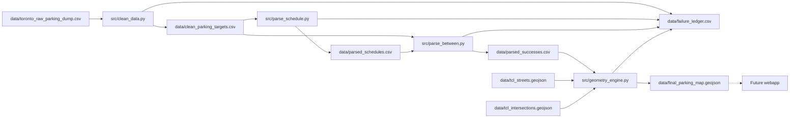

# Toronto parking bylaws — data pipeline

Turn Toronto open-data parking bylaws into cleaned, parsed, and map-ready GeoJSON. A future webapp will let users explore bylaws on an interactive Toronto map; **this repo is the data pipeline only** (webapp deferred).

## Project vision

**End goal:** A web application where users interact with a map of Toronto, zoom to any location, and see the parking bylaws (No Parking schedules) that apply at that spot.

**Current focus:** The raw city export is messy. This pipeline filters active rules, parses free-text segment descriptions (`Between`), matches streets and intersections against local Toronto Centreline (TCL) data, and writes **GeoJSON** geometries for the upcoming frontend.

## Repository layout

```
parking-pipeline/
├── data/          # Source dumps, generated CSVs, TCL GeoJSON, map output
├── docs/          # This documentation
├── src/           # Pipeline scripts
└── requirements.txt
```

## Pipeline overview



Geocoding uses **local TCL files** on disk, not a live geocoding API.

## Quick start

From the project root:

```bash
python -m venv .venv
source .venv/bin/activate   # Windows: .venv\Scripts\activate
pip install -r requirements.txt

python src/clean_data.py
python src/parse_schedule.py
python src/parse_between.py
python src/geometry_engine.py
# Quick sample (10 rows): GEO_LIMIT=10 python src/geometry_engine.py
# Parallel batch: GEO_WORKERS=4 python src/geometry_engine.py
```

Scripts resolve paths via [`src/paths.py`](../src/paths.py) (`data/` is always relative to the repo root). You can run them from any working directory.

**Geometry env vars:** `GEO_LIMIT` — cap rows processed (omit for full `parsed_successes.csv`). `GEO_WORKERS` — thread pool size (`0` = sequential). Uses `pyogrio` for GeoJSON I/O when installed.

## Scripts

| Script | Stage | Input → output |
|--------|-------|----------------|
| [`src/clean_data.py`](../src/clean_data.py) | 1 — Filter & unpack | `data/toronto_raw_parking_dump.csv` → `data/clean_parking_targets.csv` |
| [`src/parse_schedule.py`](../src/parse_schedule.py) | 1b — Parse times | `data/clean_parking_targets.csv` → `data/parsed_schedules.csv` |
| [`src/parse_between.py`](../src/parse_between.py) | 2 — Parse `Between` | `data/clean_parking_targets.csv` + `data/parsed_schedules.csv` → `data/parsed_successes.csv` |
| [`src/geometry_engine.py`](../src/geometry_engine.py) | 3 — Geocode | `data/parsed_successes.csv` + TCL GeoJSON → `data/final_parking_map.geojson` |

## Data files

| File | Source / generated | Role |
|------|-------------------|------|
| `data/toronto_raw_parking_dump.csv` | **Source** (~80k rows) | Full city open-data export (parking bylaws API/dataset) |
| `data/clean_parking_targets.csv` | Generated | Active curb-parking schedules (no park/stop/stand, restricted periods, winter/snow, permitted angle) after filter & unpack |
| `data/parsed_schedules.csv` | Generated | Structured time-of-day JSON per `_id` (`schedule_json`, `schedule_status`, `max_minutes`) |
| `data/parsed_successes.csv` | Generated | Rows where `parse_between` parsed `Between`; flat parse columns (`rule_type`, intersections, distances) plus schedule columns |
| `data/tcl_streets.geojson` | **Source** | Toronto Centreline street segments (`LINEAR_NAME_FULL_LEGAL`) |
| `data/tcl_intersections.geojson` | **Source** | Intersection points (`INTERSECTION_DESC`) |
| `data/final_parking_map.geojson` | Generated | Map-ready features: `Highway`, `Rule`, `schedule_category`, `Side`, `max`, `schedule`, `maxMinutes`, `geometry` |
| `data/failure_ledger.csv` | Generated | Row-level pipeline failures from `clean`, `schedule`, `parse`, and `geo` (`stage`, `reason_code`, `detail`, …). Join to clean targets or raw dump on `row_id` / `_id`. |

### `clean_parking_targets.csv` schema

Produced by `clean_data.py` from active curb-rule schedules in the raw dump (exact `scheduleName` allowlist: schedules 13–16 / XIII–XVI — see `ALLOWED_SCHEDULE_NAMES` in [`src/clean_data.py`](../src/clean_data.py)).

| Column | Description |
|--------|-------------|
| `_id` | Stable row identifier from the raw dump. Join back to `toronto_raw_parking_dump.csv` for fields not in the clean file. |
| `scheduleName` | Schedule title from the raw export. |
| `schedule_category` | Normalized type: `no_parking`, `no_stopping`, `no_standing`, or `restricted_periods` (one per allowed schedule). |
| `Highway` | Street or corridor name from the unpacked `ByLaw_Table`. |
| `Side` | Side of highway (e.g. north, south, both). |
| `Between` | Segment description — parsed later by `parse_between.py`. |
| `Prohibited Times and/or Days` | When the rule applies; for restricted-period rows, copied from `Times and/or Days` when needed. |
| `Maximum Period Permitted` | Populated for Parking for Restricted Periods rows (e.g. max stay). |

Rows with failed `ByLaw_Table` unpack are excluded from this file and recorded in `failure_ledger.csv` under stage `clean`. Duplicate curb segments (same highway, side, between, times, and `schedule_category`) are dropped during dedup (lowest `_id` kept) and are not ledger failures.

### `parsed_schedules.csv` and schedule JSON

Produced by [`src/parse_schedule.py`](../src/parse_schedule.py) from `Prohibited Times and/or Days` (and `Maximum Period Permitted` → `max_minutes`). Independent of TCL / `Between` parsing; run before or after `parse_between` (merge is on `_id`).

| Column | Description |
|--------|-------------|
| `_id` | Row id (join key). |
| `schedule_json` | Versioned JSON (`v: 1`) for membership filters — see [`src/schedule_format.py`](../src/schedule_format.py). |
| `schedule_status` | `anytime`, `ok`, `partial`, or `failed`. |
| `max_minutes` | Max stay in minutes when parseable; else empty. |

**Membership filter (webapp):** `overlaps_membership(schedule, slot)` in [`src/schedule_format.py`](../src/schedule_format.py).

| Slot field | Required | Notes |
|------------|----------|--------|
| `dayOfWeek` | yes | `0=Sun` … `6=Sat` (`Date.getDay()`) |
| `minuteOfDay` | yes | `0–1439` |
| `month` | yes | `1–12` |
| `dayOfMonth` | yes | `1–31` |
| `year` | recommended | Needed when `calendar.dayOfMonthRanges` uses `end: "last"` |

**Schedule JSON (additive on `v: 1`):**

- `calendar` (optional): `monthRanges` (seasonal, including year-wrap e.g. Dec–Mar), `dayOfMonthRanges` (`start` / `end` or `end: "last"`), `months` (month-list-only rules).
- `inverted` (optional): `windows` describe **except** periods; prohibition is active when calendar matches and no except-window matches.
- Per-window `calendar` overrides schedule-level `calendar` for that window.

`failed` rows return `False` from `overlaps_membership` (include-unknown is a frontend policy). `partial` uses OR over parsed windows only.

**Public holidays:** `flags.exceptPublicHolidays` uses Ontario statutory holidays via the [`holidays`](https://github.com/vacanza/python-holidays) package ([`src/public_holidays.py`](../src/public_holidays.py), observed dates). Pass `year` in the slot. Normal schedules skip holiday slots; inverted schedules treat holidays as except periods when flagged.

One-off absolute dates (`June 6, 2022`, etc.) may still be `failed` or `partial`.

Analyze remaining gaps: [`scripts/analyze_schedule_failures.py`](../scripts/analyze_schedule_failures.py).

### Joining back to raw

```python
import pandas as pd
from pathlib import Path

DATA = Path(__file__).resolve().parent.parent / "data"  # adjust if not run from src/

clean = pd.read_csv(DATA / "clean_parking_targets.csv")
raw = pd.read_csv(DATA / "toronto_raw_parking_dump.csv")

enriched = clean.merge(raw, on="_id", how="left", suffixes=("", "_raw"))
```

All other raw columns (`Latest_Action`, `Bylaw_Description`, `ByLaw_Table`, etc.) stay on the raw side of the join.

## Parsing (`parse_between.py`)

Run after `clean_data.py`. `Between` text is matched against ordered patterns in [`src/parse_between.py`](../src/parse_between.py). Successful rows are written to `parsed_successes.csv` with flat columns from [`src/parse_format.py`](../src/parse_format.py) (no embedded Python dicts).

| Column | Type | Notes |
|--------|------|--------|
| *(clean columns)* | | `_id`, `scheduleName`, `schedule_category`, `Highway`, `Side`, `Between`, times, etc. |
| `rule_type` | string | Regex rule type (see table below) |
| `start_intersection` | string | When required by rule type |
| `end_intersection` | string | block, `offset_to_intersect`, etc. |
| `offset_intersection` | string | `intersect_to_offset` |
| `start_intersection_qualifier` | string | Parenthetical disambiguation on start |
| `end_intersection_qualifier` | string | Parenthetical disambiguation on end |
| `terminus_direction` / `terminus_street` | string | Street-end rules |
| `terminus_start_dir` / `terminus_end_dir` | string | Both ends of same street |
| `distance` | float | Metres; empty when N/A |
| `direction` | string | north/south/east/west |
| `dist1`, `dist2` | float | `relative_extension`, `dual_anchor` |
| `dir1`, `dir2` | string | `relative_extension`, `dual_anchor` |
| `highway_norm` | string | Abbreviated token for `Highway` in INTERSECTION_DESC search (not used for centreline street index lookup) |
| `start_intersection_norm`, `end_intersection_norm`, `offset_intersection_norm`, `terminus_street_norm` | string | Normalized anchors for intersection matching |
| `parse_valid` | bool | Always `true` in this file — invalid pattern matches go to `failure_ledger` |
| `parse_error` | string | Empty when `parse_valid` is true |

| `rule_type` | Example pattern |
|-------------|-----------------|
| `perfect_offset` | Intersection + point N metres direction |
| `intersect_to_offset` | Intersection + point N metres direction of another street |
| `offset_to_intersect` | Point offset from one intersection to another |
| `relative_extension` | Two chained offset points (incl. compound “further east and north”) |
| `offset_span` | Two metric offsets from the same cross street (e.g. 59 m north and 62 m north of X) |
| `dual_anchor` | A point X of street A and a point Y of street B |
| `block` | Two intersections (no “point” / “metres”; no street-end phrasing) |
| `block_to_terminus` | Cross street and the west end of … |
| `terminus_to_terminus` | The west end of X and the east end of X |
| `parenthetical_block` | Walmer Road (west intersection) and Spadina Road |
| `parenthetical_end_block` | Start street and end street (east intersection) |
| `parenthetical_dual_block` | Milvan Drive (northwest intersection) and Milvan Drive (southeast intersection) |
| `parenthetical_to_terminus` | Austin Terrace (north intersection) and the east end of … |
| `intersect_extension` | Intersection + point N metres further direction |
| `entire_length` | `Entire length` |

Unmatched rows are recorded in `failure_ledger.csv` with `stage=parse` (not written to `parsed_successes.csv`). Join back to `clean_parking_targets.csv` on `_id` = `row_id` to inspect full row context.

## Geometry (`geometry_engine.py`)

Uses local TCL data only:

- Streets: exact match on `LINEAR_NAME_FULL_LEGAL` (lowercased `Highway`)
- Intersections: substring match on `INTERSECTION_DESC` via [`src/intersection_normalize.py`](../src/intersection_normalize.py) (word-boundary abbreviations, optional [`data/street_aliases.csv`](../data/street_aliases.csv))

### Centreline model (nodes + edges)

Toronto Centreline is stored as a **graph**, not a single merged polyline:

| Layer | Role |
|-------|------|
| `tcl_intersections.geojson` | **Nodes** — `INTERSECTION_ID`, `INTERSECTION_DESC`; text matching resolves cross streets to one or more node IDs |
| `tcl_streets.geojson` | **Edges** — `FROM_INTERSECTION_ID`, `TO_INTERSECTION_ID`, segment geometry; [`src/tcl_graph.py`](../src/tcl_graph.py) walks edges between nodes |

**Block-family rules** (`block`, `parenthetical_block`, `parenthetical_end_block`, `parenthetical_dual_block`, `block_to_terminus`, `parenthetical_to_terminus`) use graph paths: resolve cross streets to `INTERSECTION_ID`s, BFS shortest path on street edges, concatenate segment lines. When multiple IDs match a cross street (e.g. duplicate Colbeck nodes on Armadale), the engine picks the ID pair with the shortest valid path (fewest edges, then shortest length).

When start and end intersections lie on **disconnected TCL components** (common at offset intersections such as Manning Ave at Bloor St W or Queen St W), the engine builds a **`MultiLineString`**: one centreline path per fragment, each walked from its anchor toward the other cross street, with **no synthetic bridge** across the gap. Successful rows may include GeoJSON property `disjoint_block: true`.

**Offset / terminus rules** (Phase 2) still use **merge-longest** — all TCL chunks for a street name merged to one centreline, then `substring` by projected distance. See `.cursor/plans/tcl_graph_geometry_fix_0db8c334.plan.md` for the offset-rule redesign.

Distances along centreline: EPSG:4326 ↔ EPSG:32617; offset rules use **along-line signed distance** (arc length from intersection anchors, sign from local tangent vs N/S/E/W).

### `slice_street` results and failure ledger

`slice_street(highway, parsed_data)` returns a `SliceResult` dataclass: `geometry`, optional `reason_code`, and `detail`. On success, `reason_code` is `None` and `geometry` is set.

| `reason_code` | When |
|---------------|------|
| `STREET_NOT_FOUND` | No TCL match for `Highway` |
| `INTERSECTION_NOT_FOUND` | Start or end intersection not found |
| `DISCONNECTED_BLOCK` | Block-family rule: no graph path between resolved intersection IDs and disjoint multi-fragment retry failed (e.g. no overlapping TCL components) |
| `AMBIGUOUS_INTERSECTION` | Multiple ID pairs tie on shortest path, or parenthetical qualifier cannot disambiguate (not used for offset-intersection disconnects) |
| `UNSUPPORTED_RULE_TYPE` | Unknown `rule_type` |
| `GEOMETRY_ERROR` | Projection/slicing exception or empty geometry (non-zero-span failures) |
| `ZERO_SPAN` | Parsed rule has no mappable curb segment (e.g. anchor already at terminus); excluded from map GeoJSON — expected skip, not a bug. `block_to_terminus` uses **geographic** east/west on the graph component (not polyline parameter 0/length); cul-de-sac fallback walks to the farthest node when compass span collapses. |

Pipeline stages append failures to `data/failure_ledger.csv` via `failure_ledger.record_failure` (columns: `row_id`, `stage`, `reason_code`, `detail`, `highway`, `between`, `between_parsed_input`). Source `between` is always the clean CSV text; `between_parsed_input` is set for parse-stage failures to the string passed to regex after `preprocess_between` (empty for other stages).

| `stage` | `reason_code` | When |
|---------|---------------|------|
| `clean` | `UNPACK_PARSE_ERROR` | `ByLaw_Table` cell is not valid Python literal JSON/list syntax |
| `clean` | `UNPACK_EMPTY_TABLE` | Empty or keyless `ByLaw_Table` after parse |
| `clean` | `UNPACK_MISSING_HIGHWAY` | Unpack succeeded but `Highway` is missing |
| `parse` | `PARSE_NO_MATCH` | No ordered pattern matched `Between` |
| `parse` | `PARSE_EMPTY_BETWEEN` | `Between` is empty or missing |
| `parse` | `PARSE_INVALID` | Pattern matched but failed per-`rule_type` validation |
| `geo` | *(see table above)* | Geometry batch loop in `geometry_engine.py` `__main__` |
| `geo` | `ZERO_SPAN` | No line geometry to emit; row stays in `parsed_successes.csv` only |

### Intersection matching improvements (baseline → after)

Measured on full `parsed_successes.csv` geo run (project `.venv`):

| Metric | Before | After |
|--------|-------:|------:|
| `INTERSECTION_NOT_FOUND` | 6,601 | 3,553 |
| Geo successes (features in map) | ~12,376 | 14,582 |
| Parsed rows | 22,395 | 21,814 |

Changes: shared normalizer (fixes Weston/`St.`/Parkway/Gate/Lawn), new regex types for street ends and parentheticals, `dual_anchor` for dual point clauses, curated `street_aliases.csv`. **Out of scope:** leg-of-street phrasing (~44) and lane descriptions (~290) remain as `parse` failures in the ledger until new rules are added.

### Failure triage (`failure_ledger.csv` → `failure_triage.csv`)

Assign a `fix_tier` per ledger row (`A_intentional`, `A_skipped`, `A_trivial`, `B_quick`, `C_medium`, `D_hard`) for prioritization. Joins optional `intersection_failure_analysis.csv`, `geometry_failure_analysis.csv`, and `street_failure_analysis.csv` when present.

```bash
.venv/bin/python src/fullrun.py
# or, after a geo run:
.venv/bin/python scripts/analyze_intersection_failures.py
.venv/bin/python scripts/analyze_geometry_failures.py
.venv/bin/python scripts/analyze_street_failures.py
.venv/bin/python scripts/triage_failure_ledger.py
```

`src/fullrun.py` runs clean → parse → schedule → geometry → street analyzer → triage.

**Highway → TCL resolution** ([`src/tcl_highway_resolve.py`](../src/tcl_highway_resolve.py), [`src/lane_highway_resolve.py`](../src/lane_highway_resolve.py)): strips parentheticals/descriptors, unique base/suffix remap, Mc/hyphen spacing, gated edit-distance-1, cross-street disambiguation, and lane/laneway inference. The same base/suffix remap is also fed into [`tcl_search_tokens`](../src/intersection_normalize.py) (cross streets from Between, not only the Highway column). One-off verified renames go in [`data/highway_aliases.csv`](../data/highway_aliases.csv) (see `scripts/suggest_highway_aliases.py`).

Writes `data/failure_triage.csv` and `data/failure_triage_summary.json`.

**After ABC-tier remediation (May 2026):** ~22,638 parsed rows → **19,691+** map features (re-run geo after offset fix for latest count); `PARSE_NO_MATCH` **492** (was ~634); `GEOMETRY_ERROR` **0**. Offset rules use **graph component** centreline, inbound metric when offsets clamp at terminus, multi-node span for duplicate cross names, and graph-path fallback when projections collapse — former **~662** `ZERO_SPAN` rows should drop to **~0–2** on re-run (remainder typically `STREET_NOT_FOUND`).

### Intersection failure analysis (`INTERSECTION_NOT_FOUND`)

Re-measure and classify root causes:

```bash
.venv/bin/python scripts/analyze_intersection_failures.py
```

Writes:

- `data/intersection_failure_analysis.csv` — per-row `category`, `attribution_final`, `subcause`, `hit_production`, `tcl_match_count`, `cross_in_tcl`, `highway_in_tcl`, `highway_in_graph`
- `data/intersection_failure_summary.json` — aggregate counts and top `(highway, cross)` pairs

Uses production matching via `tcl_graph.resolve_intersection_ids` (same as `geometry_engine.py`).

### Street failure analysis (`STREET_NOT_FOUND`)

```bash
.venv/bin/python scripts/analyze_street_failures.py
.venv/bin/python scripts/suggest_highway_aliases.py
.venv/bin/python scripts/audit_highway_resolution.py
```

Writes `data/street_failure_analysis.csv` and `data/street_failure_summary.json` with `street_category`, `subcause`, `suggested_fix`, and `resolved_key_candidate` per ledger row. Triage uses these columns to split `STREET_NOT_FOUND` into `street_resolve:auto`, `street_resolve:lane`, `street_alias:needed`, and `street_not_in_tcl`.

Typical breakdown (full parsed run, **3,284** failures / 21,783 parsed):

| `attribution_final` | Share | Meaning |
|---------------------|------:|---------|
| `true_missing_or_complex` | ~71% | Plain cross-street names; pair not in TCL |
| `new_rule_or_geometry` | ~19% | Parentheticals, street ends, legs — parser/geometry rules |
| `mixed` | ~9% | Lane-first / ramp phrasing |
| `regex_misparse` | ~0.3% | Point/metre fragment assigned to intersection field |

| `subcause` (when pair misses) | Share | Action hint |
|-------------------------------|------:|-------------|
| `highway_only_in_tcl` | ~68% | Cross name not in any `INTERSECTION_DESC`; add alias or fix parse |
| `cross_only_in_tcl` | ~26% | Cross appears in TCL but not with this highway — wrong segment or pairing |
| `slash_compound_cross` | ~4% | e.g. `Elm Avenue/Nanton Avenue` — compound normalization |
| `neither_in_tcl` | ~2% | Neither token in TCL — data gap or non-street feature |
| `highway_not_in_street_graph` | rare | Highway absent from `tcl_streets` graphs |
| `failed_field_is_highway` | rare | Failed cross equals `highway` column — anchor selection bug |

Within `true_missing_or_complex`, subcause splits ~58% `highway_only_in_tcl` vs ~37% `cross_only_in_tcl`. Top repeated crosses: `Avenue Road`, `O'Connor Drive`, `St. John's Road` (alias candidates in `street_aliases.csv`).

### Phase A: token alignment (normalizer + one-off aliases)

**Policy:** Normalizer rules for **classes** of mismatches (evaluate before merge); **aliases** in [`data/street_aliases.csv`](../data/street_aliases.csv) for **one-off** bylaw names only.

```bash
# Audit alias TCL hits
.venv/bin/python scripts/evaluate_normalizer_rule.py --rule audit_aliases

# Evaluate a candidate normalizer change (exits non-zero if unsafe)
.venv/bin/python scripts/evaluate_normalizer_rule.py --rule preserve_apostrophe

# Classify remaining failures (rule / alias / skip)
.venv/bin/python scripts/suggest_street_aliases.py

# Re-run geometry + analysis
.venv/bin/python src/geometry_engine.py
.venv/bin/python scripts/analyze_intersection_failures.py
```

**Shipped in Phase A:**

- Normalizer: **preserve apostrophe** in `normalize_intersection_street` (no longer strip `'`).
- Alias fixes: `St. John's Road` → `st johns`, `Indian Road Crescent` → `indian rd`, `Austin Terrace` → `austin ter`; `Avenue Road` → `avenue rd` (unchanged).
- Parse/geometry: `row_to_parsed` uses **raw** intersection columns so aliases apply at resolve time (not stale `*_norm` CSV values).

**Measured (full geo re-run):**

| Metric | Before Phase A | After Phase A |
|--------|---------------:|--------------:|
| `INTERSECTION_NOT_FOUND` | 3,284 | 2,819 |
| Geo map features | ~15,840 | ~16,140 |

Normalizer evaluation (`preserve_apostrophe`): **+114** recoveries on scoped analysis rows, **0** regressions on golden pairs ([`data/normalizer_rule_evaluation.json`](data/normalizer_rule_evaluation.json)).

**Artifacts:** `data/phase_a_baseline_summary.json` (before), `data/normalizer_rule_evaluation.json`, `data/street_alias_suggestions.csv`.

### Geometry failure analysis (`GEOMETRY_ERROR`)

All geo-stage `GEOMETRY_ERROR` rows in the ledger use `detail=zero-length segment`: `slice_between_distances` rejects slices when anchor distances `d0` and `d1` differ by less than 1 mm along the TCL centreline.

Re-measure and classify root causes:

```bash
.venv/bin/python scripts/analyze_geometry_failures.py
```

Writes `data/geometry_failure_analysis.csv` with per-row diagnostics (`d0`, `d1`, `line_length_m`, perpendicular offsets, TCL match counts, `cause_category`, `attribution`, `fix_hint`, and `subcause` for block projection collapses).

Typical breakdown (full parsed run):

| Attribution | Share | Main causes |
|-------------|------:|-------------|
| `centreline_geometry` | ~62% | `block_projection_collapse` (cross streets project to same distance); `intersect_to_offset_collapse` |
| `clamp_at_endpoint` | ~29% | `perfect_offset_*`, `relative_extension_clamp_*`, `offset_to_intersect_collapse` |
| `valid_point_zone` | ~9% | `anchor_equals_terminus`, parenthetical-to-terminus |
| `intersection_match` | ~1% | `block_same_intersection_point` |

### Current limitations

- **`slice_street()` implements all regex `rule_type` values above.** Unknown types still return `UNSUPPORTED_RULE_TYPE`.
- **`__main__` processes the full CSV by default**; set `GEO_LIMIT` for a smaller dev run.
- Geometry reads flat parse columns via `parse_format.row_to_parsed`; broader exception logging is deferred ([PARK-61](https://jhershkop.atlassian.net/browse/PARK-61)).
- Street/intersection name matching is heuristic; ambiguous `INTERSECTION_DESC` matches can misplace segments.
- On diagonal centrelines, compass-directed offsets can be unstable when the line bearing is nearly perpendicular to the stated direction.
- Parenthetical qualifiers with no west/east/north/south keyword may return `parenthetical_ambiguous`.

## Data sources

| Asset | Notes |
|-------|--------|
| Parking bylaws dump | Toronto open data — export saved as `data/toronto_raw_parking_dump.csv`. Add the official dataset/API link here when pinned. |
| Toronto Centreline (TCL) | `data/tcl_streets.geojson` and `data/tcl_intersections.geojson` — download from the city’s centreline / open-data catalogue. Add URLs when pinned. |

## Roadmap

- **Webapp** — interactive map UI (deferred)
- **Parse coverage** — new `parse_between` patterns for ledger `PARSE_NO_MATCH` rows (leg/lane phrasing, point fragments, etc.)
- **Geometry** — improve intersection/street matching and edge-case offsets
- **Matching** — improve street and intersection normalization edge cases
