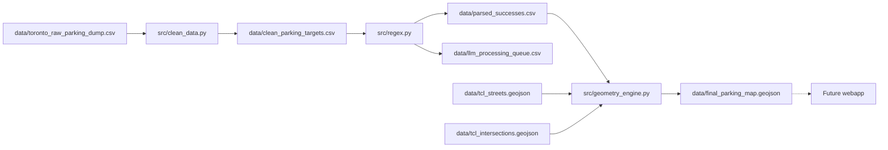

# Toronto parking bylaws — data pipeline

Turn Toronto open-data parking bylaws into cleaned, parsed, and map-ready GeoJSON. A future webapp will let users explore bylaws on an interactive Toronto map; **this repo is the data pipeline only** (webapp deferred).

## Project vision

**End goal:** A web application where users interact with a map of Toronto, zoom to any location, and see the parking bylaws (No Parking schedules) that apply at that spot.

**Current focus:** The raw city export is messy. This pipeline filters active rules, parses free-text segment descriptions (`Between`), matches streets and intersections against local Toronto Centreline (TCL) data, and writes **GeoJSON** geometries for the upcoming frontend.

## Repository layout

```
Parking/
├── data/          # Source dumps, generated CSVs, TCL GeoJSON, map output
├── docs/          # This documentation
├── src/           # Pipeline scripts
└── requirements.txt
```

## Pipeline overview



Geocoding uses **local TCL files** on disk, not a live geocoding API.

## Quick start

From the project root:

```bash
python -m venv .venv
source .venv/bin/activate   # Windows: .venv\Scripts\activate
pip install -r requirements.txt

python src/clean_data.py
python src/regex.py
python src/geometry_engine.py
```

Scripts resolve paths via [`src/paths.py`](../src/paths.py) (`data/` is always relative to the repo root). You can run them from any working directory.

## Scripts

| Script | Stage | Input → output |
|--------|-------|----------------|
| [`src/clean_data.py`](../src/clean_data.py) | 1 — Filter & unpack | `data/toronto_raw_parking_dump.csv` → `data/clean_parking_targets.csv` |
| [`src/regex.py`](../src/regex.py) | 2 — Parse `Between` | `data/clean_parking_targets.csv` → `data/parsed_successes.csv` + `data/llm_processing_queue.csv` |
| [`src/geometry_engine.py`](../src/geometry_engine.py) | 3 — Geocode | `data/parsed_successes.csv` + TCL GeoJSON → `data/final_parking_map.geojson` |

## Data files

| File | Source / generated | Role |
|------|-------------------|------|
| `data/toronto_raw_parking_dump.csv` | **Source** (~80k rows) | Full city open-data export (parking bylaws API/dataset) |
| `data/clean_parking_targets.csv` | Generated | ~14k active No Parking rows after filter & unpack |
| `data/parsed_successes.csv` | Generated | Rows where regex parsed `Between`; includes `parsed_data` |
| `data/llm_processing_queue.csv` | Generated | Rows regex could not parse (future LLM pass) |
| `data/tcl_streets.geojson` | **Source** | Toronto Centreline street segments (`LINEAR_NAME_FULL_LEGAL`) |
| `data/tcl_intersections.geojson` | **Source** | Intersection points (`INTERSECTION_DESC`) |
| `data/final_parking_map.geojson` | Generated | Map-ready features: `Highway`, `Rule`, `geometry` |
| `data/failure_ledger.csv` | Generated | Row-level pipeline failures (`stage`, `reason_code`, etc.) |

### `clean_parking_targets.csv` schema

Produced by `clean_data.py` from active No Parking schedules in the raw dump.

| Column | Description |
|--------|-------------|
| `_id` | Stable row identifier from the raw dump. Join back to `toronto_raw_parking_dump.csv` for fields not in the clean file. |
| `scheduleName` | Schedule title (e.g. which No Parking schedule the rule belongs to). |
| `Highway` | Street or corridor name from the unpacked `ByLaw_Table`. |
| `Side` | Side of highway (e.g. north, south, both). |
| `Between` | Segment description — parsed later by `regex.py`. |
| `Prohibited Times and/or Days` | When parking is prohibited for this rule. |

### Joining back to raw

```python
import pandas as pd
from pathlib import Path

DATA = Path(__file__).resolve().parent.parent / "data"  # adjust if not run from src/

clean = pd.read_csv(DATA / "clean_parking_targets.csv")
raw = pd.read_csv(DATA / "toronto_raw_parking_dump.csv")

enriched = clean.merge(raw, on="_id", how="left", suffixes=("", "_raw"))
```

All other raw columns (`Latest_Action`, `Bylaw_Description`, `ByLaw_Table`, etc.) stay on the raw side of the join.

## Parsing (`regex.py`)

`Between` text is matched against ordered regex rules. Successful parses store a dict-like string in `parsed_data` with a `rule_type`:

| `rule_type` | Example pattern |
|-------------|-----------------|
| `perfect_offset` | Intersection + point N metres direction |
| `intersect_to_offset` | Intersection + point N metres direction of another street |
| `offset_to_intersect` | Point offset from one intersection to another |
| `relative_extension` | Two chained offset points |
| `block` | Two intersections (no “point” / “metres” in text) |
| `intersect_extension` | Intersection + point N metres further direction |
| `entire_length` | `Entire length` |

Unmatched rows go to `llm_processing_queue.csv`.

## Geometry (`geometry_engine.py`)

Uses local TCL data only:

- Streets: exact match on `LINEAR_NAME_FULL_LEGAL` (lowercased `Highway`)
- Intersections: substring match on `INTERSECTION_DESC` after normalizing abbreviations
- Distances along centreline: EPSG:4326 ↔ EPSG:32617 via Shapely `substring`

### `slice_street` results and failure ledger

`slice_street(highway, parsed_data)` returns a `SliceResult` dataclass: `geometry`, optional `reason_code`, and `detail`. On success, `reason_code` is `None` and `geometry` is set.

| `reason_code` | When |
|---------------|------|
| `STREET_NOT_FOUND` | No TCL match for `Highway` |
| `INTERSECTION_NOT_FOUND` | Start or end intersection not found |
| `UNSUPPORTED_RULE_TYPE` | Parsed type not yet implemented (e.g. `perfect_offset`) |
| `GEOMETRY_ERROR` | Projection/slicing exception or empty geometry |

The geometry batch loop (`geometry_engine.py` `__main__`) appends failures to `data/failure_ledger.csv` via `failure_ledger.record_failure` (columns: `row_id`, `stage`, `reason_code`, `detail`, `highway`, `between`; `stage` = `geo`).

### Current limitations

- **`slice_street()` only implements** `entire_length`, `intersect_extension`, and `block`. Other `rule_type` values return `UNSUPPORTED_RULE_TYPE` and are recorded in the ledger.
- **`__main__` processes `df.head(13750)`** — not necessarily the full `parsed_successes.csv`.
- `ast.literal_eval` failures are recorded as `GEOMETRY_ERROR` in the ledger; broader exception logging is deferred ([PARK-61](https://jhershkop.atlassian.net/browse/PARK-61)).
- Street/intersection name matching is heuristic; ambiguous `INTERSECTION_DESC` matches can misplace segments.

## Data sources

| Asset | Notes |
|-------|--------|
| Parking bylaws dump | Toronto open data — export saved as `data/toronto_raw_parking_dump.csv`. Add the official dataset/API link here when pinned. |
| Toronto Centreline (TCL) | `data/tcl_streets.geojson` and `data/tcl_intersections.geojson` — download from the city’s centreline / open-data catalogue. Add URLs when pinned. |

## Roadmap

- **Webapp** — interactive map UI (deferred)
- **LLM pass** — parse rows in `llm_processing_queue.csv`
- **Geometry** — implement remaining `rule_type` handlers in `slice_street()`
- **Matching** — improve street and intersection normalization edge cases
