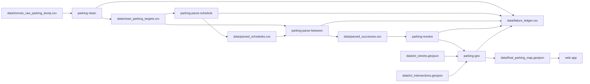

# Toronto parking bylaws — pipeline deep-dive

Python ETL for Toronto parking bylaws. **Start at the [monorepo README](../../README.md)** for setup, data downloads, and tests. The interactive map lives in [`web/`](../../web/).

## Repository layout (monorepo)

```
parking-pipeline/          # repo root
├── pipeline/
│   ├── data/              # Source dumps, generated CSVs, TCL GeoJSON, map output
│   ├── docs/              # This documentation
│   ├── scripts/           # Analysis, triage, fixture builders
│   ├── src/parking_pipeline/   # Installable package
│   └── tests/
└── web/                   # React + MapLibre map UI
```

## Pipeline overview



Geocoding uses **local TCL files** on disk, not a live geocoding API.

## Quick start

From the repo root (first time or after pull):

```bash
./scripts/setup.sh
source .venv/bin/activate
```

From `pipeline/`:

```bash
parking-clean
parking-parse-schedule
parking-parse-between
parking-resolve    # auto-refreshes tcl_street_names.csv when stale
parking-geo
# Or run all stages + analysis: parking-run
```

Use `-v` / `--verbose` on any stage for debug logging, or set `PARKING_VERBOSE=1`.

**Geometry env vars:** `GEO_LIMIT` — cap rows processed (omit for full `parsed_successes.csv`). `GEO_WORKERS` — thread pool size (`0` = sequential). Threading helps I/O-bound steps; CPU-heavy Shapely work may see limited speedup under the GIL.

Paths resolve via [`src/parking_pipeline/paths.py`](../src/parking_pipeline/paths.py) (`data/` is relative to `pipeline/`).

## Console scripts

| Command | Module | Stage |
|---------|--------|-------|
| `parking-clean` | `clean_data` | Filter & unpack raw dump |
| `parking-parse-schedule` | `parse_schedule` | Parse time-of-day strings |
| `parking-parse-between` | `parse_between` | Parse `Between` segment text |
| `parking-resolve` | `resolve_rows` | Map `Highway` → TCL keys |
| `parking-geo` | `geometry_engine` | Slice centreline geometry |
| `parking-run` | `fullrun` | All stages + failure analysis |

## Metrics snapshot (2026-06-18)

Full local run against Toronto open-data exports (see [Data sources](#data-sources)). `parking-resolve` keeps `tcl_street_names.csv` in sync with `tcl_streets.geojson` automatically.

| Metric | Value |
|--------|------:|
| Raw bylaw rows | 76,849 |
| Clean curb-rule targets | 23,152 |
| Parsed (`Between`) rows | 22,941 |
| Highway resolved to TCL | 22,763 (99.2%) |
| **Map features (GeoJSON)** | **21,433** |
| `INTERSECTION_NOT_FOUND` (geo) | 1,174 |
| `RESOLVE_STREET_NOT_FOUND` | 178 |
| `PARSE_NO_MATCH` | 188 |
| `ZERO_SPAN` | 67 |
| `GEOMETRY_ERROR` (collapse) | 0 |
| `GEOMETRY_EXCEPTION` | 0 |
| `EMPTY_GEOMETRY` | 0 |

**Historical context:** Early pipeline runs reported ~6,600 `INTERSECTION_NOT_FOUND` failures and ~12k map features before intersection normalizer work, new regex rule types, and alias tables. The snapshot above reflects the current codebase on the same city datasets.

## Data files

| File | Source / generated | Role |
|------|-------------------|------|
| `data/toronto_raw_parking_dump.csv` | **Source** | Full city open-data export |
| `data/clean_parking_targets.csv` | Generated | Active curb-parking schedules after filter & unpack |
| `data/parsed_schedules.csv` | Generated | Structured time-of-day JSON per `_id` |
| `data/parsed_successes.csv` | Generated | Rows where `Between` parsed successfully |
| `data/tcl_streets.geojson` | **Source** | Toronto Centreline street segments |
| `data/tcl_intersections.geojson` | **Source** | Intersection points |
| `data/tcl_street_names.csv` | Generated | Unique TCL legal names for highway resolve |
| `data/final_parking_map.geojson` | Generated | Map-ready features for the web app |
| `data/failure_ledger.csv` | Generated | Row-level failures from all stages |

Committed [`data/samples/`](../data/samples/) fixtures let tests and CI run without the full ~120 MB TCL download.

## Schedule JSON contract

Produced by [`parse_schedule.py`](../src/parking_pipeline/parse_schedule.py) / [`schedule_format.py`](../src/parking_pipeline/schedule_format.py). Embedded in GeoJSON as the `schedule` property (`v: 1`).

**Membership filter:** `overlaps_membership(schedule, slot)` — same contract implemented in Python and in [`web/src/lib/schedule/`](../../web/src/lib/schedule/). Cross-language parity is enforced by [`tests/fixtures/schedule_corpus.json`](../tests/fixtures/schedule_corpus.json) (regenerate via `PYTHONPATH=src python scripts/build_schedule_corpus.py`).

| Slot field | Required | Notes |
|------------|----------|--------|
| `dayOfWeek` | yes | `0=Sun` … `6=Sat` |
| `minuteOfDay` | yes | `0–1439` |
| `month` | yes | `1–12` |
| `dayOfMonth` | yes | `1–31` |
| `year` | recommended | Needed for `calendar.dayOfMonthRanges` with `end: "last"` |

`failed` schedules return `False` from `overlaps_membership` (the web app may still show them with a warning). `partial` uses OR over parsed windows only. Ontario public holidays use the `holidays` package ([`public_holidays.py`](../src/parking_pipeline/public_holidays.py)).

Range-based helpers (`overlapsMembershipInRange`, `membershipFullyCoversRange`) exist only in the web app for time-window filtering.

## Parsing (`parse_between`)

Ordered regex patterns in [`parse_between.py`](../src/parking_pipeline/parse_between.py) match `Between` text. Successful rows land in `parsed_successes.csv` with flat columns from [`parse_format.py`](../src/parking_pipeline/parse_format.py).

| `rule_type` | Example pattern |
|-------------|-----------------|
| `perfect_offset` | Intersection + point N metres direction |
| `intersect_to_offset` | Intersection + point N metres direction of another street |
| `offset_to_intersect` | Point offset from one intersection to another |
| `relative_extension` | Two chained offset points |
| `offset_span` | Two metric offsets from the same cross street |
| `dual_anchor` | A point X of street A and a point Y of street B |
| `block` | Two intersections |
| `block_to_terminus` | Cross street and the west end of … |
| `terminus_to_terminus` | Both ends of the same street |
| `parenthetical_block` | Walmer Road (west intersection) and Spadina Road |
| `entire_length` | `Entire length` |

Unmatched rows are recorded in `failure_ledger.csv` with `stage=parse`.

## Resolve (`resolve_rows`)

Maps bylaw `Highway` values to TCL centreline keys via [`tcl_highway_resolve.py`](../src/parking_pipeline/tcl_highway_resolve.py) and [`lane_highway_resolve.py`](../src/parking_pipeline/lane_highway_resolve.py). Refreshes `tcl_street_names.csv` from `tcl_streets.geojson` when missing or stale ([`street_names_csv.py`](../src/parking_pipeline/street_names_csv.py)). Curated renames go in `data/highway_aliases.csv` and `data/street_aliases.csv` (gitignored; download or maintain locally).

## Geometry (`geometry_engine`)

Uses local TCL data via [`geo_indices.py`](../src/parking_pipeline/geo_indices.py), [`geo_slice.py`](../src/parking_pipeline/geo_slice.py), and [`tcl_graph.py`](../src/parking_pipeline/tcl_graph.py).

**Block-family rules** walk centreline graphs between resolved intersection IDs. **Offset / terminus rules** merge TCL chunks and slice by projected distance along the centreline.

| `reason_code` | When |
|---------------|------|
| `STREET_NOT_FOUND` | No TCL match for highway |
| `INTERSECTION_NOT_FOUND` | Cross street not found in intersection index |
| `DISCONNECTED_BLOCK` | No graph path between intersection IDs |
| `AMBIGUOUS_INTERSECTION` | Multiple ID pairs tie on shortest path |
| `ZERO_SPAN` | No mappable curb segment (expected skip) |
| `GEOMETRY_ERROR` | Degenerate projection / zero-length segment (collapse) |
| `GEOMETRY_EXCEPTION` | Unhandled slice exception |
| `EMPTY_GEOMETRY` | Slice returned empty geometry |
| `MISSING_RULE_TYPE` | Row reached geo without `rule_type` |
| `PARSE_INVALID` | Parse validation failed (may surface at geo stage) |

## Failure triage

```bash
parking-run
# Or individually:
PYTHONPATH=src python scripts/analyze_intersection_failures.py
PYTHONPATH=src python scripts/analyze_geometry_failures.py
PYTHONPATH=src python scripts/analyze_street_failures.py
PYTHONPATH=src python scripts/triage_failure_ledger.py
```

Writes `data/failure_triage.csv` and `data/failure_triage_summary.json` with `fix_tier` labels (`A_intentional`, `A_skipped`, `B_quick`, `C_medium`, `D_hard`).

## Tests

```bash
cd pipeline
pytest
ruff check src tests scripts
```

Schedule parity: `tests/test_schedule_corpus.py` and `web/src/lib/schedule/corpus.test.ts` share `tests/fixtures/schedule_corpus.json`.

## Data sources

| Asset | URL |
|-------|-----|
| Parking bylaws dump | [Traffic and Parking By-law Schedules](https://open.toronto.ca/dataset/traffic-and-parking-by-law-schedules/) |
| Toronto Centreline (TCL) | [Toronto Centreline (TCL)](https://open.toronto.ca/dataset/toronto-centreline-tcl/) |
| Intersection file | [Intersection file](https://open.toronto.ca/dataset/intersection-file-city-of-toronto/) |

## Current limitations

- Street/intersection matching is heuristic; ambiguous `INTERSECTION_DESC` matches can misplace segments.
- On diagonal centrelines, compass-directed offsets can be unstable.
- Leg-of-street and lane phrasing remain parse failures until new rules are added.
- Parenthetical qualifiers without compass keywords may return `parenthetical_ambiguous`.

## Roadmap

- **Parse coverage** — new `parse_between` patterns for remaining `PARSE_NO_MATCH` rows
- **Geometry** — further intersection/street matching edge cases
- **Web** — see [`web/README.md`](../../web/README.md)
